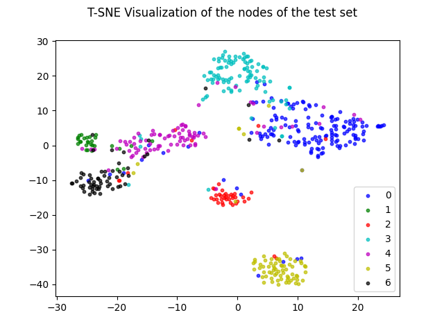

<!-- # Comparative Study — DeepWalk vs. Graph Neural Networks (GNN & GAT) -->

<!-- > A hands‑on reproduction and analysis of traditional random‑walk embeddings versus modern message‑passing networks on benchmark citation and co‑purchase graphs. -->
<!-- 

  

 -->

<h1 align="center">Comparative Study — DeepWalk vs Graph Neural Networks</h1>

  <em>Do message‑passing models really outclass random walks?  
  A systematic revisit across citation and e‑commerce graphs.</em>

  
  
  
  

  

---

## Table of Contents
1. [Project Overview](#project-overview)
3. [Methodology](#methodology)  
   * [DeepWalk](#DeepWalk)  
   * [Graph Neural Network (GNN)](#2-graph-neural-network-gnn)  
   * [Graph Attention Network (GAT)](#3-graph-attention-network-gat)  
4. [Datasets](#datasets)  
5. [Experiments](#experiments)  
   * [Training & Evaluation](#training--evaluation)  
   * [Results](#results)  

---

## Project Overview
This project benchmarks three families of graph‑representation methods:

| Model | Paradigm | Supervision | Implementation |
|-------|----------|-------------|----------------|
| **DeepWalk** | Random walks + Skip‑Gram | ✗ (unsupervised) | Implemented *from scratch* (Word2Vec via gensim) |
| **GNN w/ MLP** | Message passing | ✓ (supervised) | Pure PyTorch |
| **GAT** | Attention‑based message passing | ✓ (supervised) | Pure PyTorch (no PyG) |

Our goal is to quantify **node‑classification accuracy** and **embedding quality** on three standard graphs: *Cora*, *Citeseer*, and *Amazon‑Computers*. See the [PDF report](report/report.pdf) for the full theoretical background and extended discussion.

---

## Methodology
### 1&nbsp;·&nbsp;DeepWalk
* **Random walks**: 100 walks × length 10 per node  
* **Embedding size**: 128  
* **Training**: Skip‑Gram + negative sampling on the walk corpus

### 2&nbsp;·&nbsp;Graph Neural Network (GNN)
* **Layers**: 2  
* **Aggregation**: mean → MLP  
* **Hidden size**: 128  
* **Activation**: ReLU

### 3&nbsp;·&nbsp;Graph Attention Network (GAT)
* **Layers**: 2 (8 heads each)  
* **Attention**: additive (LeakyReLU, α = 0.2)  
* **Dropout**: input 0.6 &nbsp;|&nbsp; attention 0.6  

_For the mathematical update rules, see Section 3 of the full report._

---

## Datasets
| Dataset | Nodes | Edges | Classes |
|---------|-------|-------|---------|
| **Cora** | 2 708 | 5 429 | 7 |
| **Citeseer** | 3 327 | 4 732 | 6 |
| **Amazon‑Computers** | 13 752 | 245 861 | 10 |

_All graphs are treated as undirected and pre‑processed with self‑loops removed._

---

## Experiments
### Training & Evaluation Setup
* **Split**: 60 % train · 20 % val · 20 % test (stratified)  
* **Optimizer**: Adam (lr = 1 e‑3) + OneCycleLR  
* **Loss**:  
  * Cross‑entropy for GNN / GAT  
  * Logistic regression classifier on fixed DeepWalk embeddings  
* **Early stopping**: patience = 50 epochs on validation accuracy  

---

## Results
### 1 · Node‑Classification Accuracy
| Model | Cora | Citeseer | Amazon‑Computers |
|-------|------|----------|------------------|
| **GNN** | **85.6 %** | **70.0 %** | 63.5 % |
| **GAT** | 84.3 % | 69.8 % | 87.1 % |
| **DeepWalk** | 85.1 % | 59.6 % | **88.6 %** |

### 2 · Embedding Visualisation (t‑SNE)
| Cora | Citeseer | Amazon‑Computers |
|------|----------|------------------|
|  |  |  |
|  |  |  |
|  |  |  |

_For all theoretical background and extended discussion of these numbers and plots, please refer to the accompanying PDF report._

